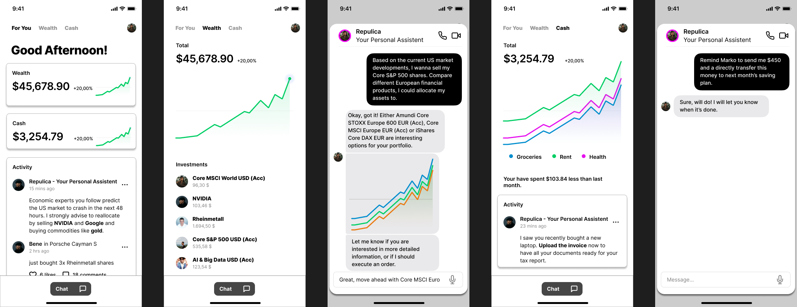

# Welcome to your Lovable project

## One Sentence Pitch

The only app you need to manage every part of your financial life, to democratize wealth. 

## Product Overview

Click here to launch the app or follow the steps below to install 

```sh
# Step 1: Clone the repository using the project's Git URL.
git clone <YOUR_GIT_URL>

# Step 2: Navigate to the project directory.
cd <YOUR_PROJECT_NAME>

# Step 3: Install the necessary dependencies.
npm i

# Step 4: Start the development server with auto-reloading and an instant preview.
npm run dev
```



## Tech Stack

This project is built with:

- Vite
- TypeScript
- React
- shadcn-ui
- Tailwind CSS

## Challenges faced

- building a front end as developers with no front-end dev experience might result in a wild ride -> luckily, tools like [Lovable](https://lovable.dev/) can be impressively useful! most important thing is to focus on fast iteration instead of lengthy prompts

- making sure the other person really understands what you envision for how a feature should look like and be used when implemented -> use tools like [Figma](https://www.figma.com) to quickly visualize your idea so other people see what you are thinking about

## Interesting Facts

This project took about 
- 250 Lovable-tokens to create.
- 4 people working about 24 hrs each.

# People Involved

- [Marko Alten](https://github.com/orgs/CDTM-Hackathon-2025/people/m4rk0401)
- [Finn Schäfer](https://github.com/orgs/CDTM-Hackathon-2025/people/finn1901)
- [Vasilije Rakčević](https://github.com/orgs/CDTM-Hackathon-2025/people/VasilyRakche)
- [Henri Höchter](https://github.com/orgs/CDTM-Hackathon-2025/people/henrihoechter)
